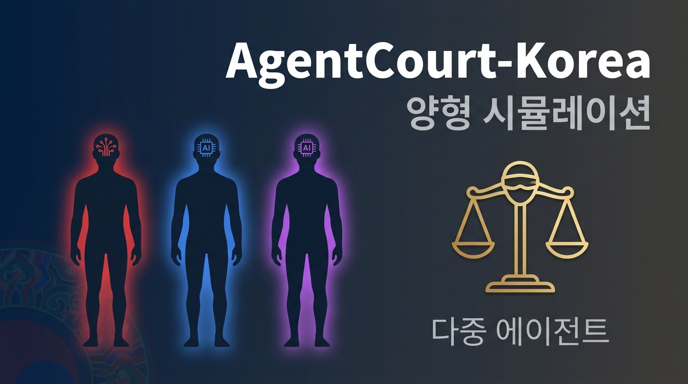
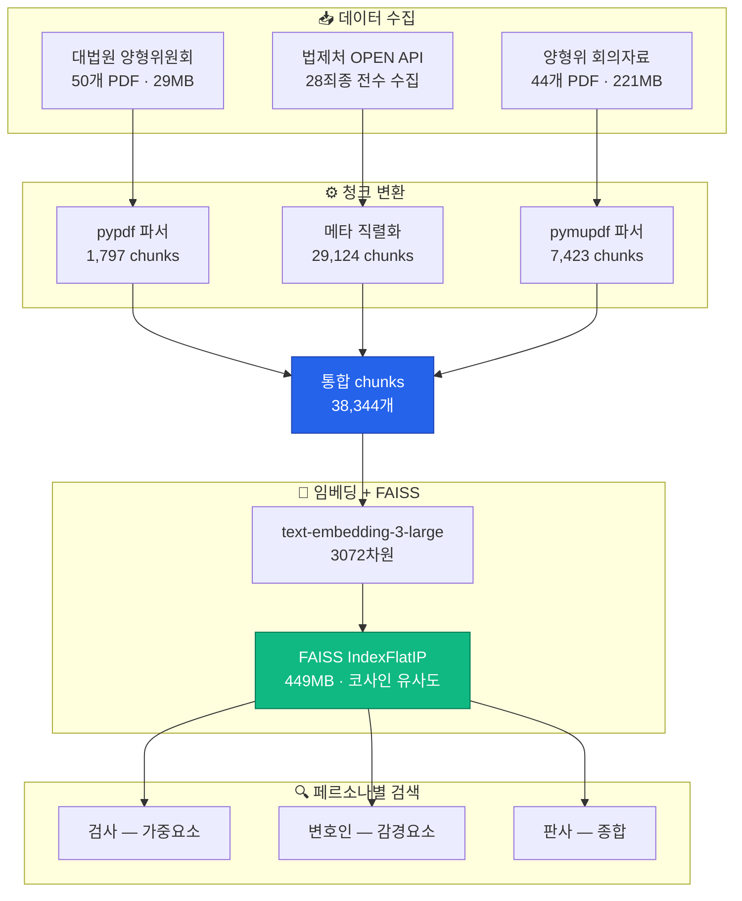
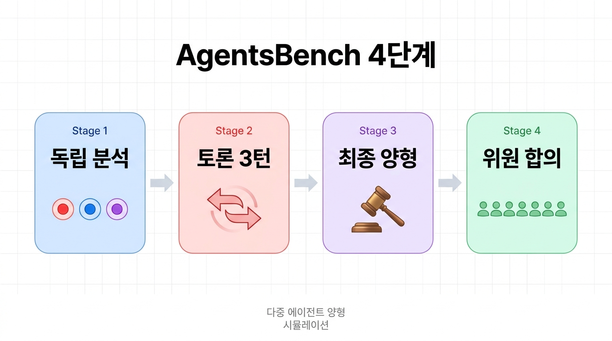
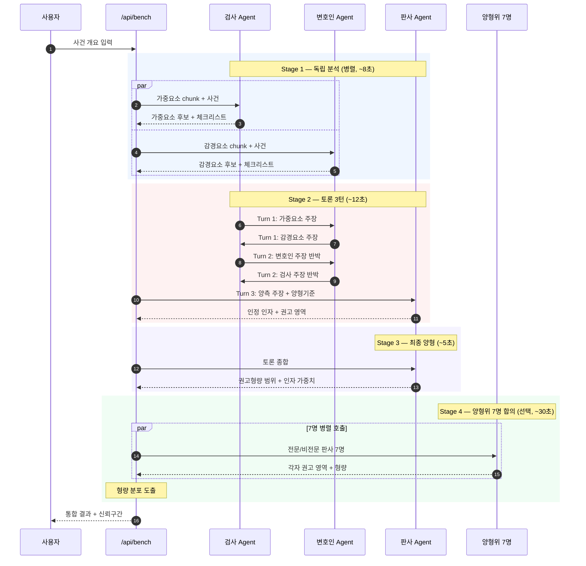
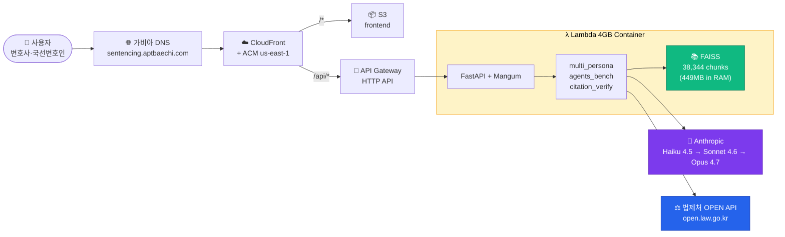
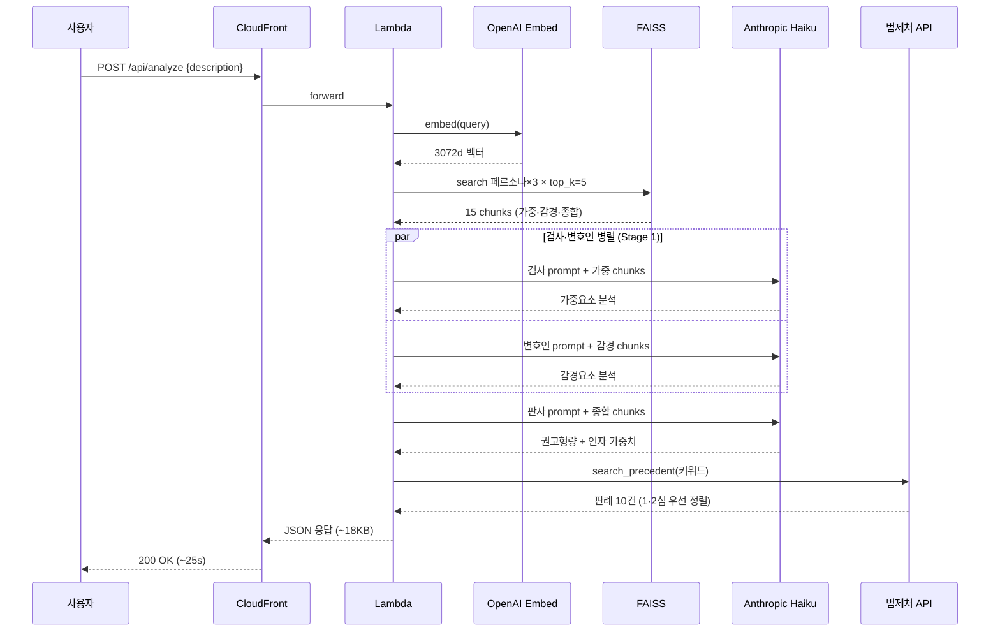
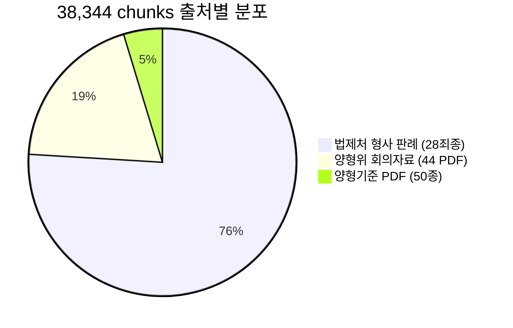
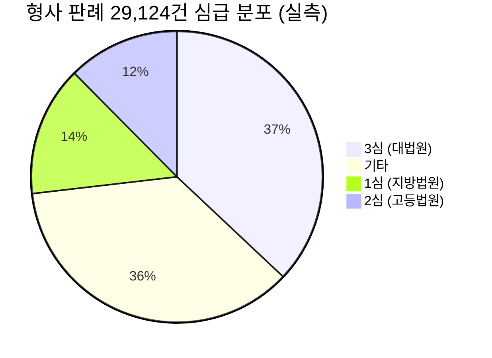

# AgentCourt-Korea



> **Multi-agent court simulation for Korean criminal sentencing**
> Inspired by AgentsBench (MDPI Systems 2025) + AgentCourt (arXiv 2408.08089) + AgentsCourt (EMNLP 2024 Findings).

[](https://sentencing.aptbaechi.com)
[](LICENSE)
[]()

행정안전부 「제14회 범정부 공공데이터·AI 활용 창업경진대회 — 법제처 트랙」 출품작.

대법원 양형위원회 양형기준 + 법제처 OPEN API 형사 판례 + 양형위 회의자료를 통합한
**다중 에이전트 양형 의사결정 시뮬레이션 시스템**.

---

## 📊 데이터 파이프라인



---

## ⚖️ AgentsBench 4단계 시뮬레이션





---

## 🏛 시스템 아키텍처



---

## ⏱ 요청 흐름 (POST /api/analyze, ~25초)



---

## 📈 데이터 분포 (실측)





---

## ✨ 특징

### 1. **38,344 chunks RAG 인덱스** (text-embedding-3-large, 3072d, FAISS 449MB)
- 양형기준 50개 PDF (살인·강도·성범죄 등 범죄군별 + 종합본) → **1,797 chunks**
- 법제처 OPEN API 형사 판례 28죄종 전수 수집 → **29,124 chunks**
- 양형위원회 회의자료 44개 PDF → **7,423 chunks**

### 2. **AgentsBench 4단계 다중 에이전트 시뮬레이션** (`/api/bench`)
```
Stage 1 — 독립 분석 (병렬)        검사·변호인·판사 LLM이 각자 청크 검색 + 분석
Stage 2 — 토론 3턴                 양측 반박 → 판사 종합
Stage 3 — 최종 양형                권고형량 영역 + 인자 가중치 결정
Stage 4 — 양형위 7명 합의          전문/비전문 위원 분포 도출 (불확실성 정량화)
```
> 단발 RAG → AgentsBench 4단계로 양형 의사결정 과정 모사.

### 3. **LLM 환각 방지 인용 검증** (`/api/verify-citations`)
- LLM이 생성한 사건번호·법령 조문을 법제처 OPEN API로 cross-check
- 결과: ✓ exists / ✗ absent (환각) / ⚠ ambiguous
- chrisryugj/korean-law-mcp `verify_citations` 패턴 채택.

### 4. **1·2심 우선 정렬**
- 일상범죄 양형 사례는 1심·2심에 풍부 (대법원은 법리 위주)
- `prefer_lower_inst=True` 시 판례 결과를 1심·2심 → 3심 순으로 재정렬
- 사건번호 패턴 (고합·고단·고정·고약 → 노 → 도) 기반 심급 추정.

### 5. **Anthropic Cascade**
- Haiku 4.5 (속도 우선) → Sonnet 4.6 → Opus 4.7 자동 폴백
- 30초 안에 3-페르소나 분석 + 법제처 판례 매칭 완료 (병렬화).

---

## 🏗 아키텍처

```
┌─────────────────────────────────────────────────────────────┐
│              사용자 (sentencing.aptbaechi.com)               │
└──────────────────────────────┬──────────────────────────────┘
                               │
                        ┌──────▼──────┐
                        │  CloudFront  │ (ACM us-east-1)
                        │ E2HI2L8N…    │
                        └──┬───────┬───┘
              /*           │       │           /api/*
                           │       │
                           ▼       ▼
               ┌─────────────┐  ┌────────────────────────┐
               │ S3 frontend │  │  API Gateway HTTP API  │
               │  (정적)      │  │   g10rxgc4yd           │
               └─────────────┘  └─────────┬──────────────┘
                                           │
                                ┌──────────▼──────────┐
                                │ Lambda Container 4GB │
                                │  aptbaechi-          │
                                │  sentencing-rag      │
                                └─────┬───────┬────────┘
                       ┌──────────────┘       └─────────────┐
                       ▼                                     ▼
        ┌─────────────────────────┐          ┌──────────────────────────┐
        │ FAISS 38,344 chunks    │          │  Anthropic Haiku 4.5     │
        │  • 양형기준 50 PDF     │          │  → Sonnet 4.6            │
        │  • 형사 판례 29,124    │          │  → Opus 4.7              │
        │  • 회의자료 44 PDF     │          └──────────────────────────┘
        └─────────────────────────┘                       ▲
                       ▲                                   │
                       │                       ┌───────────┴───────────┐
                       │                       │  법제처 OPEN API      │
                       │                       │  open.law.go.kr       │
                       │                       └───────────────────────┘
                       │
        ┌──────────────┴──────────────┐
        │ OpenAI text-embedding-3-large│
        │  (3072d, 일회성 인덱싱)      │
        └─────────────────────────────┘
```

---

## 🚀 빠른 시작

### 환경변수 (.env)
```bash
LAW_API_KEY=YOUR_OC_HERE         # open.law.go.kr 가입 후 발급
LAW_API_MODE=real
OPENAI_API_KEY=sk-…              # 임베딩 (text-embedding-3-large)
EMBEDDING_PROVIDER=openai
EMBEDDING_MODEL=text-embedding-3-large
ANTHROPIC_API_KEY=sk-ant-…       # 페르소나 LLM
GEMINI_API_KEY=…                 # 폴백 (선택)
INDEX_DIR=data
```

### 데이터 수집 + 인덱싱
```bash
# 1. 양형위 50개 PDF 다운로드 (~30MB)
python scripts/download_all_pdfs.py

# 2. 형사 판례 전수 수집 (~15MB, 28죄종 29k건)
python scripts/fetch_all_precedents.py

# 3. 양형위 회의자료 PDF 수집
python scripts/fetch_committee_pdfs.py

# 4. 청크 생성 (양형기준 + 판례 + 회의자료 합본)
python scripts/rebuild_chunks_v2.py        # 양형기준 PDF
python scripts/build_precedents_chunks.py  # 판례 메타 → chunks
python scripts/add_committee_chunks.py     # 회의자료 PDF (pymupdf)

# 5. FAISS 인덱싱 (~$3.5, OpenAI Realtime)
python scripts/build_index.py
```

### 로컬 실행
```bash
pip install -r deploy/requirements-lambda.txt
uvicorn web.app:app --reload --port 7860
# → http://localhost:7860
```

### Lambda 배포
```bash
docker build --platform linux/amd64 -f deploy/Dockerfile -t agentcourt-korea:v1 .
# ECR push + Lambda update-function-code (deploy/ 참고)
```

---

## 📡 API

### `POST /api/analyze` — 단발 RAG 분석 (~25s)
```json
{
  "description": "사기죄 5천만원 초범 변제 합의 안 됨 부양가족 1인",
  "top_k": 5,
  "prefer_lower_inst": true
}
```
응답: 검사·변호인·판사 페르소나 분석 + 법제처 판례 (1·2심 우선) + 권고형량.

### `POST /api/bench` — AgentsBench 4단계 시뮬레이션
```json
{
  "description": "...",
  "top_k": 5,
  "full_4_stages": true
}
```
응답: Stage 1~4 모든 산출물 + 양형위 7명 분포.

### `POST /api/verify-citations` — LLM 환각 검증
```json
{ "text": "대법원 2019도18764 판결과 형법 제347조 위반…" }
```
응답: 사건번호·법령 인용 검증 + hallucination_rate.

### `GET /api/health`
```json
{
  "retriever": {"ok": true, "chunks": 38344, "mode": "vector"},
  "llm": "anthropic",
  "law_api": "real"
}
```

---

## 📚 학술적 근거

| 본 시스템의 구성요소 | 참조 논문 / 프로젝트 |
|---|---|
| 4단계 시뮬레이션 (독립 → 토론 → 최종 → 합의) | [AgentsBench (MDPI Systems 2025)](https://www.mdpi.com/2079-8954/13/8/641) |
| Adversarial 토론 패턴 | [AgentCourt (arXiv 2408.08089)](https://arxiv.org/abs/2408.08089) |
| 법정 토론 + KB 검색 + 정제 | [AgentsCourt (EMNLP 2024 Findings)](https://arxiv.org/abs/2403.02959) |
| 한국 법률 NLP 벤치마크 | [LBOX OPEN (NeurIPS 2022 D&B)](https://arxiv.org/abs/2206.05224) |
| 인용 검증 가드 | [chrisryugj/korean-law-mcp](https://github.com/chrisryugj/korean-law-mcp) |
| 양형기준·범죄군 분류 | [대법원 양형위원회 양형기준 해설 2025](https://sc.scourt.go.kr/sc/krsc/pdf/sc_explan_doc.pdf) |
| 사건번호 부호 (고합·고단·고정·고약/노/도) | 대법원 사건구분 안내 (재판예규 제1353호) |

---

## 💡 도메인 전문가 검토 반영

본 시스템은 **법학 전공·검찰 준비 경력자(KRX 한효린)** + **법조계 종사자(경희대 곽윤재)** 의 직접 검토를 반영했습니다.

### 한효린 (법학 전공·검찰 준비)
> "양형기준에 기존 판례들 학습시켜서… 누구나 솔깃할 거 같지 않아???"
→ **양형기준 + 판례 mix 학습**이 본 시스템의 핵심 (38,344 chunks).

> "음주운전 전력 4번 + 이번 한 번 더 → 어느정도 처벌받을까?"
→ **재범 양형 시나리오** sample-cases #2 직접 구현.

> "감경사유들도 있어 범죄유형 따라서 교육 이수 / 정신상담 / 등등, 감경받을 수 있는 요소를 제안까지"
→ **변호인 페르소나** (`PERSONA_FILTER["defender"] = {"감경요소", "권고형량"}`) 가 정확히 이 역할.

> "검사가 양형기준표 아니고 본인 룰에 의해 구형기준 따라서 체크해서 쓴다"
→ **검사 페르소나**도 양형기준에 매이지 않고 가중요소 위주 분석 (`PROSECUTOR_PROMPT`).

> "법률사무소 상담 때 (사용)"
→ 타깃 사용자 = **변호사·국선변호인**. README disclaimer 명시.

### 곽윤재 (법조계)
> "보복 등 동기 불량, 가혹한 방법, 기괴한 통로로 집어넣지 않은 이상 AI 예상 힘들 거 같다, 결국 판검사가 체크해서 선택"
→ **AI 한계 인지** — 본 시스템은 형량 예측 X. 양형기준·판례 검색 + 체크리스트 제공만. 최종 판단은 판검사 재량.

### 알려진 한계
| 한계 | 설명 | 대응 |
|---|---|---|
| **경합범 양형** | 범죄 2개 이상 경합 시 양형이 복잡해짐 (한효린) | 시스템은 단일 죄종 우선. 경합범 사용자 입력 시 disclaimer 강화. |
| **정성 평가** | 보복 동기·가혹 방법 등 정성 인자는 AI 예측 어려움 (곽윤재) | 양형기준 인자 체크리스트만 제공. 가중치는 판사 재량. |
| **양형부당 상고 제한** | 형사소송법 제383조 4호 — 사형/무기/10년+ 사건만 양형부당 상고 가능 | 분석 결과에 "10년 미만 형량 시 양형부당 상고 불가" 단서 표기 권고. |
| **법제처 판례 50% 대법원** | 1·2심 양형 사례는 43%로 충분하지만 대법원 비중 큼 | `prefer_lower_inst=True` 기본값으로 1·2심 우선 노출. |

---

## ⚖️ 면책

본 시스템은 **변호사·국선변호인의 양형기준 검색 보조 도구**입니다.
실제 양형은 담당 판사 재량이며, 본 시스템 결과는 법적 효력이 없습니다.
LLM 환각을 줄이기 위해 `/api/verify-citations`로 인용을 cross-check하지만,
모든 결과는 1차 출처(양형기준 PDF, 법제처 OPEN API)와 직접 대조 후 사용해야 합니다.

---

## 📜 라이센스

MIT License — see [LICENSE](LICENSE).

데이터 출처:
- 양형기준: 대법원 양형위원회 (sc.scourt.go.kr) — 공공누리 1유형 (출처표시)
- 판례: 법제처 국가법령정보 공동활용 (open.law.go.kr) — 공공누리 1유형
- 회의자료: 대법원 양형위원회 — 공공누리 1유형

---

## 🙏 감사

- 대법원 양형위원회 — 양형기준·해설·회의자료 공개
- 법제처 — OPEN API 무료 제공 (일일 한도, display=100)
- AgentCourt 저자 (Chen et al., 2024) — 다중 에이전트 법정 시뮬레이션 영감
- chrisryugj — verify_citations MCP 도구 패턴
